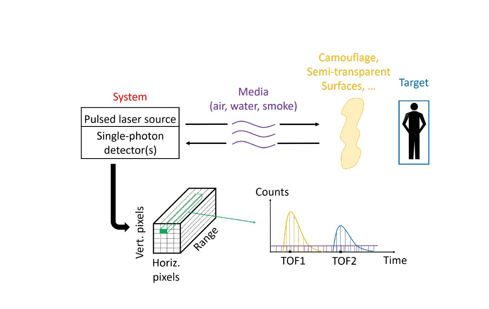

# Depth-estimation-using-lidar
This projects provides a solution using a generated simulated lidar histogram to estimate the depth image using a simple matched filter algorithm and display the results.

## Installation
Python 3.8
Matlab 2022

## Data Description
The Lidar System provides a 3-D cube of data where two dimensions are related to pixels and the third is related to time-of-flight or range. 
The Lidar data is seen as _Depth_CameraMan.mat_

 

## Guide
```
The solution.m and **solution.py** are the matlab and python code for converting the lidar to data to depth images.
```

## Results


