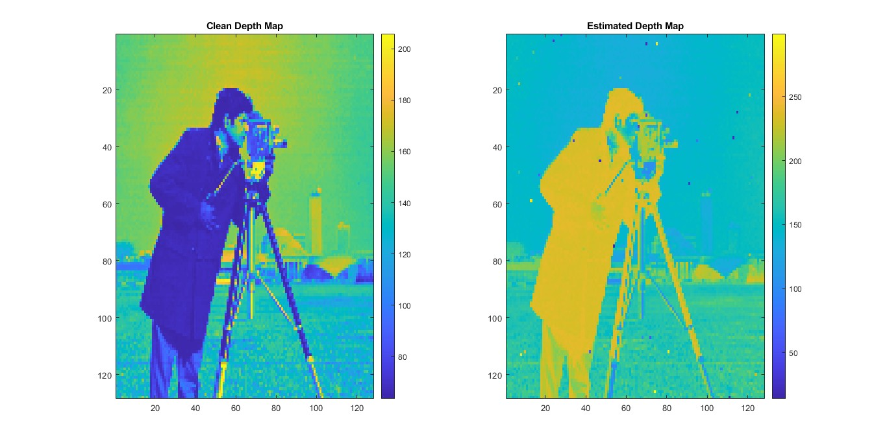
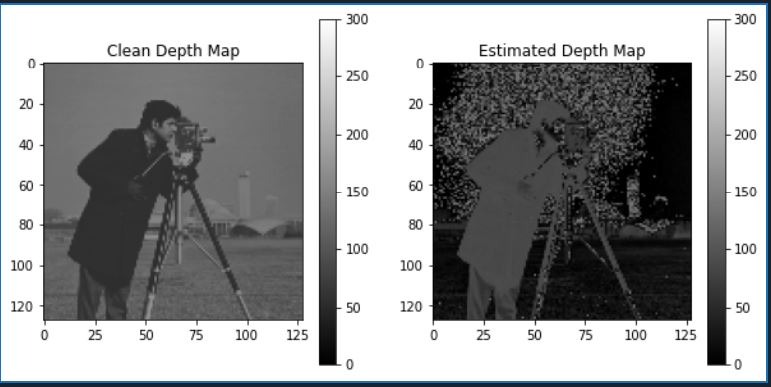

# Depth-estimation-using-lidar
This projects provides a solution using a generated simulated lidar histogram to estimate the depth image by applying a simple matched filter algorithm.

## Installation
1. Python 3.8
2. Matlab 2022

## Data Description
The Lidar System provides a 3-D cube of data where two dimensions are related to pixels and the third is related to time-of-flight or range. 
The original depth image is seen as _Depth_CameraMan.mat_

 

## Guide
```
The solution.m and solution.py are the matlab and python code respectively for converting the lidar data to depth images.
```

## Results

**Depth Images from running Matlab Code**

 


**Depth Image from running Python Code**

 

